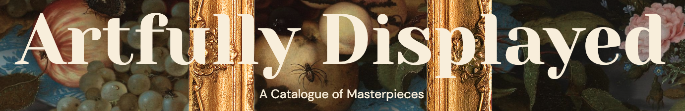
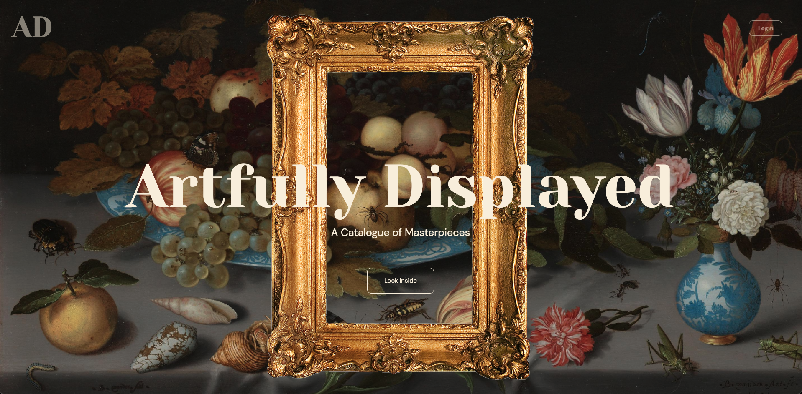

# Artfully Displayed

This is a full-stack project that uses the Rijksmuseum’s API to fetch their collection. The purpose of this app is to explore the museum's collection, which includes over 10,000 objects, and gain a better understanding of what objects are in the collection. When users are logged in, they can create a virtual exhibition by liking objects in the main search and present their exhibition with an introductory blurb. Other users are able to leave comments on their experience with the virtual exhibition.

---

## Project Setup

### The Frontend

1. Open a terminal in VS Code
2. Type `cd client`
3. Type `yarn install`

Use `yarn start` to start the frontend dev environment.

### The Backend

1. Open _another_ terminal in VS Code
2. Type `cd server`
3. Type `yarn install`

Use `yarn start` to start the backend dev environment.

--- 

### Apis Used

- [Rijksmuseum API](https://data.rijksmuseum.nl/object-metadata/api/)
- [Auth0](https://auth0.com/)
- [DiceBear](https://www.dicebear.com/how-to-use/http-api)

### Backend Server 

The server is running on MongoDB using RESTful practices and features `GET`, `PATCH`, `POST`, and `DELETE` methods. 

---

Click to see video demonstration